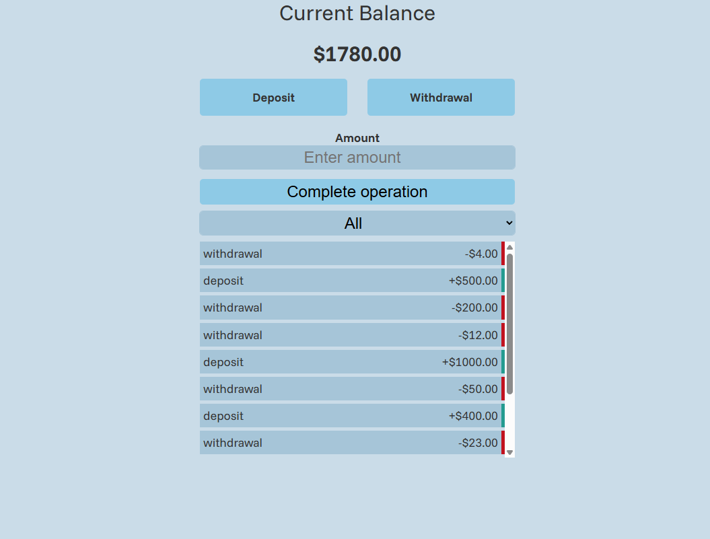
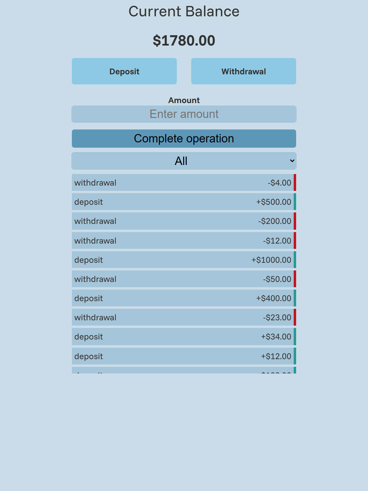
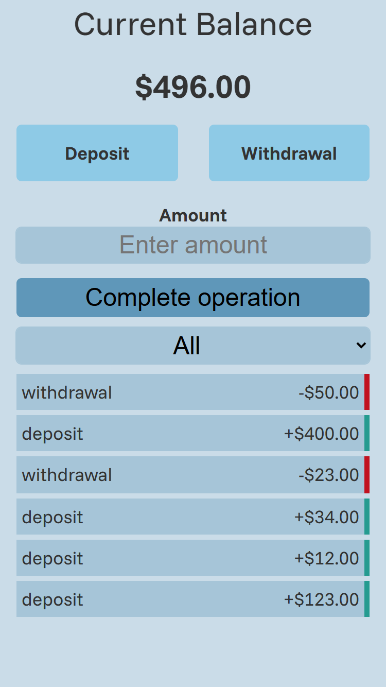

# 💰 Bank Transaction Tracker

A modern web application to manage income and expenses, track balance changes, and visualize transaction history in real time.

---

## 🚀 Live Demo

🔗 You can try the application here:
👉 https://raullimon3.github.io/bank-transaction-tracker/

---

## 📸 Preview





---

## 🧠 Features

* ➕ Add income and expense transactions
* ➖ Delete transactions
* 💰 Real-time balance calculation
* 📊 Income vs expenses breakdown
* 💾 Data persistence using LocalStorage
* ⚡ Modular JavaScript architecture
* 📱 Responsive design

---

## 🛠️ Tech Stack

* **HTML5**
* **CSS3**
* **JavaScript (ES6+)**

---

## 📂 Project Structure

```plaintext
📁 project-root
├── 📁 assets
│   └── 📁 previews
│       └── preview.png
├── 📁 css
│   └── style.css
├── 📁 js
│   ├── logic.js
│   ├── main.js
│   ├── state.js
│   ├── ui.js
│   └── utils.js
├── index.html
└── README.md
```

---

## 🧩 Architecture Overview

The application follows a modular structure:

* **main.js** → App entry point
* **state.js** → Global state management
* **logic.js** → Business logic (calculations, data handling)
* **ui.js** → DOM manipulation and rendering
* **utils.js** → Helper functions

This separation improves scalability, readability, and maintainability.

---

## 📌 Usage

1. Enter a transaction name
2. Add an amount:

   * Positive → Income
   * Negative → Expense
3. View updated balance instantly

---

## 🎯 Project Purpose

This project was built to strengthen skills in:

* DOM manipulation
* State management
* Modular JavaScript design
* Clean code practices

---

## 🧪 Future Improvements

* 🔍 Transaction filtering
* 📅 Add dates to transactions
* 📊 Data visualization (charts)
* ☁️ Backend integration (API)

---

## 👨‍💻 Author

Developed by **Raúl Limón**  
Frontend Developer in progress 🚀

- GitHub: [RaulLimon3](https://github.com/RaulLimon3)  
- LinkedIn: https://www.linkedin.com/in/raul-limon-garcia/
